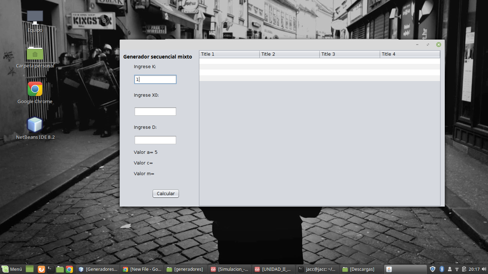
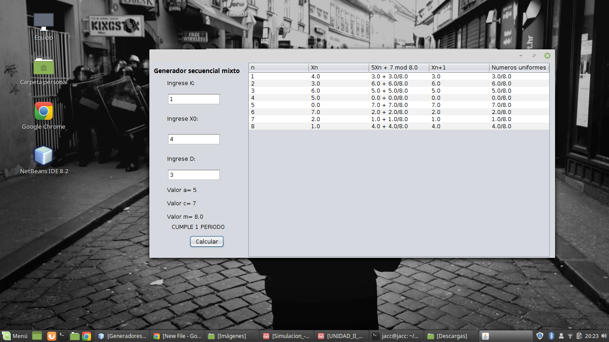
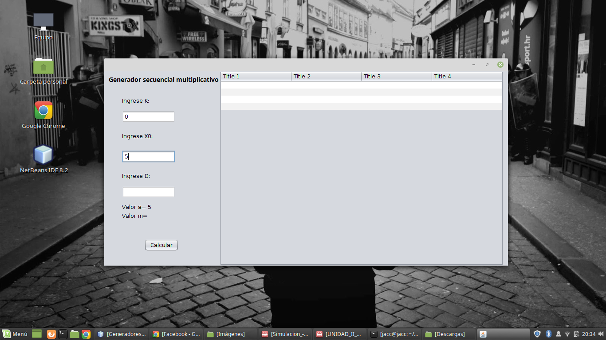
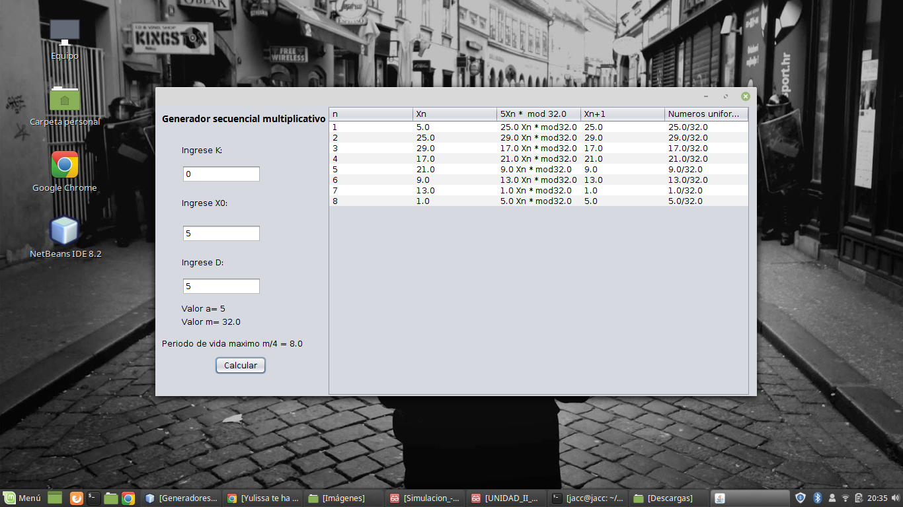

# Simulación

Nombre: Joel Cartuche

Curso: 6° "B"
# Generadores lineales

# Generador lineal mixto
  1. Se ingresa el valor de k que debe ser entero y mayor a 0 :
  
  
    Una vez ingresado el valor se calculara a
  2. Se ingresa el valor de X0 que debe ser entero y mayor a 0:
  
  
  3. Se ingresa el valor de D que debe ser entero y mayor a 0:
  
  
    Una vez ingresado d se calculara automaticamente m y c
  4.Presionar el boton de calcular para ver los resultados:
  
# Generador lineal multiplicativo

  1. Se ingresa el valor de k que debe ser entero y mayor a 0 :
  
  
    Una vez ingresado el valor se calculara a
  2. Se ingresa el valor de X0 que debe ser entero y mayor a 0:
  
  
  3. Se ingresa el valor de D que debe ser entero y mayor a 0:
  
  
    Una vez ingresado d se calculara automaticamente m, en este caso no se calcula c
  4.Presionar el boton de calcular para ver los resultados:
  
  
  
  
  
  
  
  
